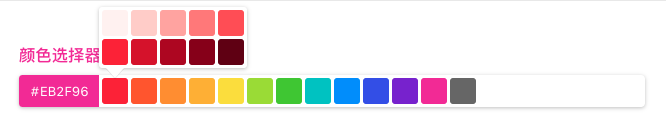

# color-picker-g

---
ColorPicker component based on antd with [`React`](https://facebook.github.io/react/)

[![NPM version][npm-image]][npm-url]

[npm-image]: https://img.shields.io/npm/v/color-picker-g.svg
[npm-url]: https://www.npmjs.com/package/color-picker-g

## Screenshot




## Demo

online example: https://favori.gitee.io/gantd-landing (CodePen)

## install

[](https://npmjs.org/package/color-picker-g)

## Feature

- Standard color board based on Antd
- Support read and write separation

## Usage

```js
import React from 'react';
import ColorPicker from 'color-picker-g';

function BasicUse() {
  const [color, setColor] = useState('#EB2F96');
  return <ColorPicker
      value={color}
      onChange={setColor.bind(null)}
    />
}

React.render(<BasicUse/>, mountNode);
```

## API

[Documentation](https://jhildenbiddle.github.io/css-vars-ponyfill)

## Contact

- Create a [Github issue](https://github.com/jhildenbiddle/css-vars-ponyfill/issues) for bug reports, feature requests, or questions
- Follow [@GantFDT](https://twitter.com/jhildenbiddle) for announcements
- Add a ⭐️ [star on GitHub](https://github.com/jhildenbiddle/css-vars-ponyfill) to support the project❤️!

## Anthor 

GantFDT

## License

MIT